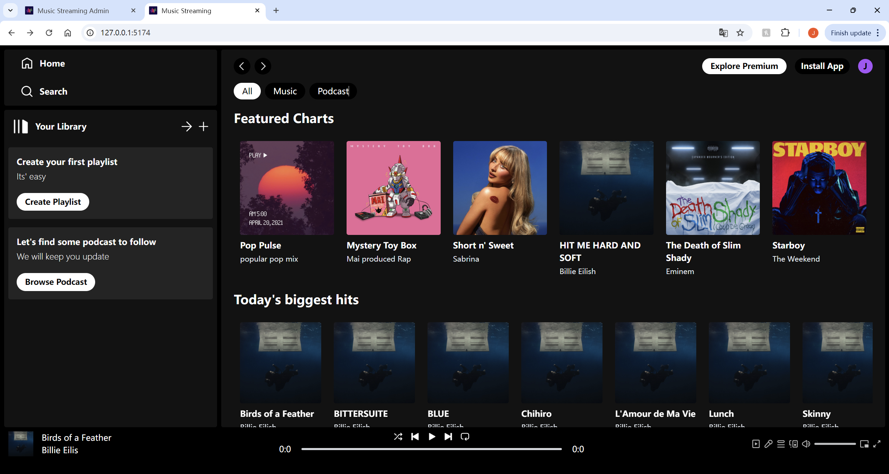
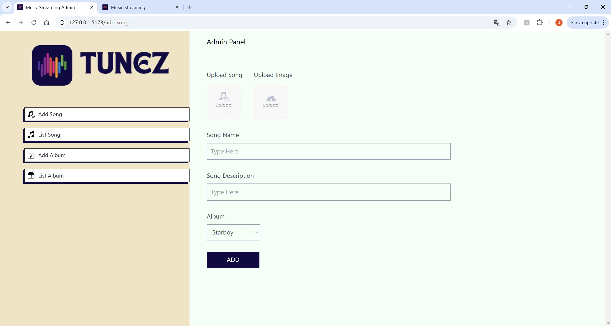

# Music Streaming System 🎶

Welcome to the **Music Streaming System**, a full-featured music streaming platform built with the MERN stack. This project currently allows users to create and manage playlists, stream songs, and enjoy a responsive interface for music playback.

## Features

- **Playlist Creation**: Create, update, and delete dynamic playlists.
- **Music Streaming**: Stream songs with seamless media controls.
- **Responsive UI**: A clean, responsive interface built with React and Tailwind CSS for smooth user experience across all devices.

## Tech Stack

- **Frontend**: React, Tailwind CSS
- **Backend**: Node.js, Express.js
- **Database**: MongoDB
- **Admin Panel**: A dedicated admin panel for managing platform content

## Here's the preview of the system:

Frontend

Admin Panel

